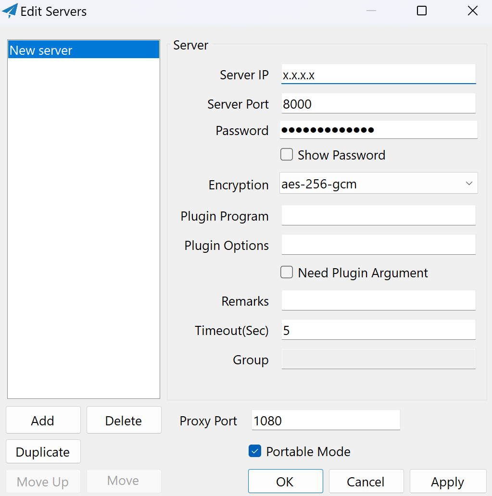
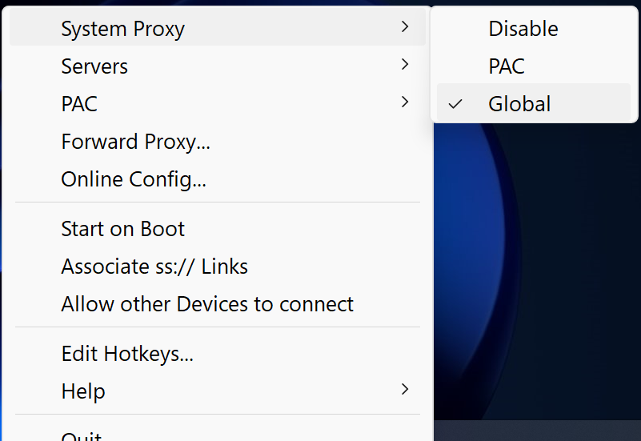

# Deploy Shadowsocks proxy server to Linode with Terraform
This repository contains the Terraform configuration files and shell scripts to automate the deployment of a Linode cloud instance of a Shadowsocks proxy server. With a few commands you can provision and deprovision a shadowsocks proxy to the cloud with a fresh IP address.

For more information on the Shadowsocks proxy see https://shadowsocks.org.
## Deployment steps

### Set Environment Variables
Run the set_vars.sh script to set the environment variables required by the Terraform configuration.
```bash
source ./set_vars.sh
```
| Variable name | Description |
|:------------|:----------|
| TF_VAR_linode_API_token | `Access token for Terraform to connect to the Linode API` |
| TF_VAR_ssh_public_key   | `SSH public key for authentication to the Linode` |
| TF_VAR_root_password    | `Root password for the Linode instance` |
| TF_VAR_shadowpassword   | `Password for remote Shadowsocks server`|
| TF_VAR_username         | `Limited sudo user for the Linode`|
| TF_VAR_password         | `Password for limited sudo user`|


To avoid hardcoding secrets into Terraform configuration files, they are set as environment variables. Prefixing the environment variables with **TF_VAR_** allows Terraform to automatically assign them to the corresponding variables declared in **variables.tf**.

e.g. **TF_VAR_linode_API_token** is assigned to the variable with the name **linode_API_token**.

### Initialize Terraform configuration and deploy resources
Terraform specifies a core workflow for initializing and deploying resources using the CLI. 

First run the **init** command. This configures the backend, installs providers and modules,  and creates the **terraform.lock.hcl** version lockfile.

```
terraform init
```

Optional but useful is the **fmt** command, which cleans up the format of the configuration files.
```
terraform fmt
```

Also optional but useful is the **validate** command. This command checks whether the configuration is syntactically valid and internally consistent, before Terraform reaches out to any external provider API's.
```
terraform validate
```

The next required command is **plan**. This creates an execution plan to deploy your specified resources, and lets you preview the changes that Terraform plans to make to your infrastructure.
```
terraform plan
```

The **apply** command executes actions proposed in the Terraform plan. Once executed Terraform will connect to Linode API and request the provisioning of the specified resources. Once complete, resources should be visible in the Linode dashboard.
```
terraform apply
```

## Connect to virtual machine instance
Configuring your local machine to use the remote proxy requires installing a local Shadowsocks client (see below). However if you need to directly connect into the deployed Linode virtual machine you can do so via SSH. As per the **output.tf** file, the instance id and IP address should be output to the terminal once complete. Use the IP address to connect to the newly created cloud machine.
```bash
ssh root@<instance_ip_addr>
```

## Deprovision resources
If you no longer need the Linode instance and want to clean up, simply run the **destroy** command, and the resources will be deprovisioned. 
```
terraform destroy
```

Finally if you want to unset the environment variables initialized earlier, use the **unset_vars.sh** script.
```bash
source ./unset_vars.sh
```

## Using Shadowsocks proxy
This Terraform configuration automates the deployment of the Shadowsocks remote server.
Using the proxy requires installing a local client. There are numerous tutorials for installing the local client depending on your operating system. See this guide for installing the local client:
https://www.linode.com/docs/marketplace-docs/guides/shadowsocks/

Once the local client is installed, use the GUI interface to configure the client with the remote server IP address and the Shadowsocks password. 

<p align="left">
  
</p>

The 'Server' IP field is the IP of the remote server created by Terraform. This value is the **<instance_ip_addr>** output to the terminal by the **outputs.tf** file. 

Set 'Server Port' to 8000.

Password is the **TF_VAR_shadowpassword** environment variable set by the **set_vars.sh** script. To to get the 'Password' echo the value of **TF_VAR_shadowpassword** to the terminal.

```bash
echo $TF_VAR_shadowpassword
```


To configure your machine to use the remote proxy, right click the Shadowsocks GUI icon.

<p align="left">
  
</p>

And set 'System Proxy' to 'Global'.
<p align="left">
  
</p>

